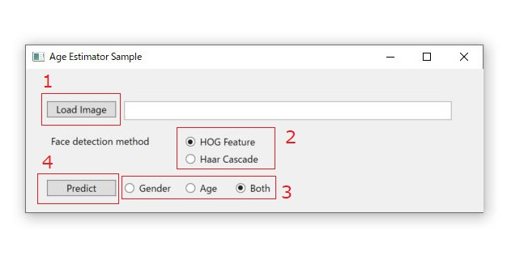
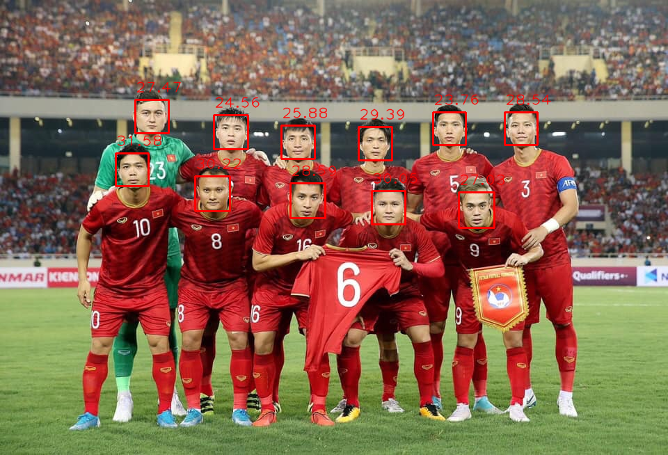
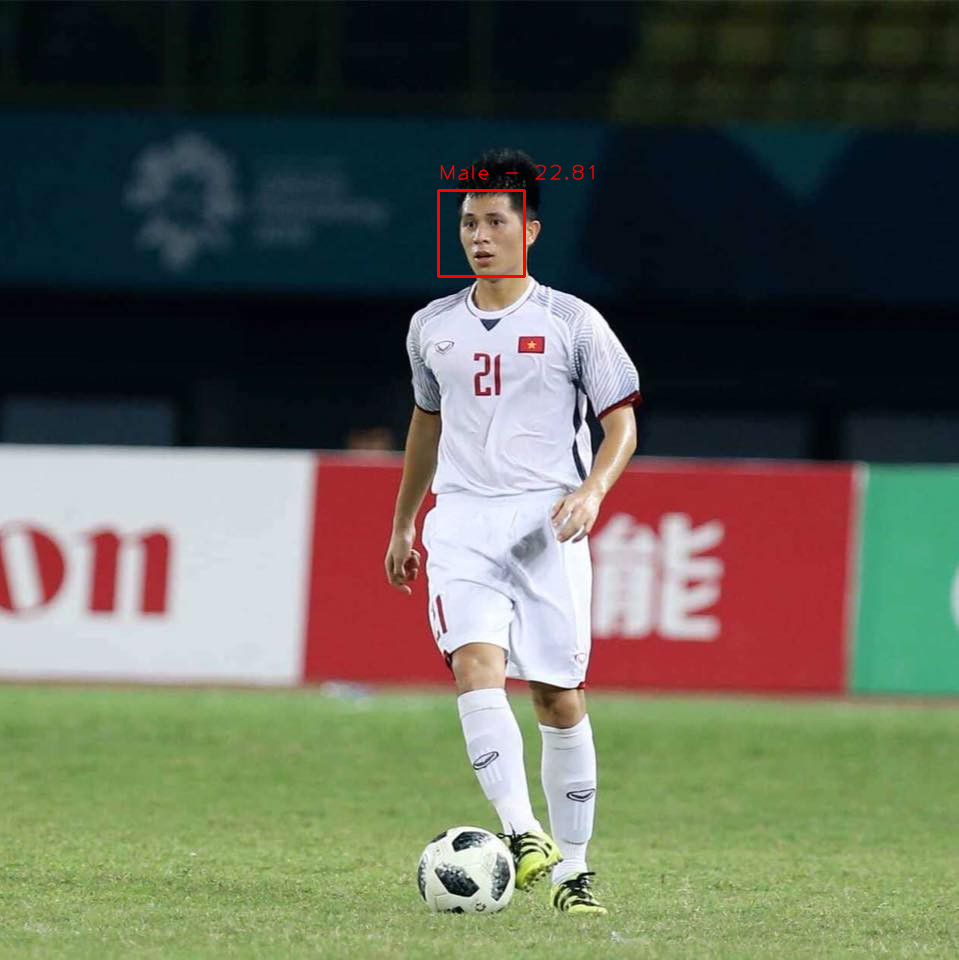
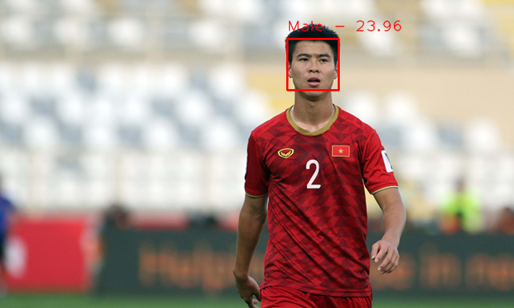

# About

Ever heard of Microsoft's Age Guesser or any of its clone? Want to try it out but afraid that your picture(s) might be collected without you knowing? Then worry no more, this repository will allow you to guess your own age from your picture, using your own computer.

This is a class library to detect face(s) from a picture and apply deep learning technology to guess the gender and age of all people detected. It also comes with a sample program which you can run without installing.

The model was trained on the [AFAD](https://afad-dataset.github.io/) dataset using fine-tuning based on the VGG19 architecture (originally trained on the ImageNet database). It has archived a 96.67% accuracy for gender predicting and a Mean Absolute Error of 3.88 for age guessing.

# Menu

* [About](#about)
* [The AFAD dataset](#the-afad-dataset)
* [System requirements and installing](#system-requirements-and-installing)
    - [Software version](#software-version)
    - [Installing](#installing)
* [Manual](#manual)
    - [AgeEstimatorSharp manual](#ageestimatorsharp-manual)
        - [If you only want to predict gender](#if-you-only-want-to-predict-gender)
        - [If you only want to guess age](#if-you-only-want-to-guess-age)
        - [If you want to guess both gender and age](#if-you-want-to-guess-both-gender-and-age)
        - [Use the predictor object created above](#use-the-predictor-object-created-above)
    - [How to use your own models](#how-to-use-your-own-models)
    - [Sample program manual](#sample-program-manual)
* [License](#license)

# The AFAD dataset

This is a Asian faces dataset, which contains more than 160,000 facial images. It has samples belong to both sexes, and the age range is mostly in the 15~40 range.

Because of that, while gender predicting can work reasonably well for people of all races and age groups; age guessing performs best for Asian people in the 15-40 age range. Especially for the 20-30 age range, I have achieved some remarkable results.

**Note**: the AFAD dataset is made available for academic research purpose only. I will not public my models with this repository, but you can train those models yourself following my repository here.

https://github.com/duongntbk/age_estimator_model

# System requirements and installing

## Software version

- OS: Windows
- .NET Framework: 4.6.1 and above
- Tensorflow.NET v0.14.0
- SciSharp v1.15.0
- NumSharp v0.20.5
- DlibDotNet v19.18.0.20191202
- OpenCvSharp3 v4.0.0.20181129

## Installing

Nuget packages is not ready yet. To use this library, clone this repository, add AgeEstimatorSharp project to your solution and add a new reference to it.

On the otherhand, the sample program is ready to be used as is (if you have .NET Framework 4.6.1 or above). 
- Download and extract the executable file. Beware that due to all dependent libraries, the sample program takes up nearly 90MB compressed.
- Open *Sample.exe.config*, modify row 333~335 as below:
    - *meanjsonpath*: channel-wise mean value of training data, use to normalize input data.
    - *agemodelpath*: absolute path to age guesser model. This model should be in pb format.
    - *gendermodelpath*: absolute path to gender predicting model. This model should be in pb format.

All dll can be download from *release* tab.

# Manual

## AgeEstimatorSharp manual

### Create necessary objects

Create a face detector object. You can choose between HOG Feature using DlibDotNet.

    var expandRatio = 1.2f;
    hogLocator = new FaceLocatorDlib(expandRatio);

Or Haar Cascade using OpenCvSharp3.

    var expandRatio = 1.0f;
    var haarCascadePath = "C:\\haarcascade_frontalface_alt2.xml";
    haarLocator = new FaceLocatorOpenCv(expandRatio, haarCascadePath);

You can also add your own face detector by implementing the *ILocatable* interface.

Create an object to extract and resize all face regions from picture.

    resizer = new FaceResizer();

You can also add your own resizer by implementing the *IResizable* interface.

Create a list of preprocessors to perform normalization on input data.

    meanJsonPath = "C:\\mean.json";
    meanPreprocessor = new MeanPreprocessor(meanJsonPath); // mean normalization
    unitPreprocessor = new UnitPreprocessor(); // normalize input data into [0, 1] range
    preprocessors = new List<IProcessor>
    {
        meanPreprocessor,
        unitPreprocessor
    };

You can add your own preprocessor by implementing the *IProcessor* interface.

### If you only want to predict gender

Create a runner object to perform calculation on gender predicting model.

    var modelPath = "C:\\gender_model.pb"; // Path to pb graph of gender predicting model
    var inputNode = "vgg19_input"; // name of input node of pb graph above
    var outputNode = "dense_3_1/Sigmoid"; // name of output node of pb graph above
    genderRunner = new PbRunner
    {
        Config = new ModelConfig
        {
            ModelPath = modelPath,
            NodeNames = new List<string>
            {
                inputNode,
                outputNode
            }
        }
    };

Create an object of class *GenderClassifier* and pass all objects created above to it.

    var faceHeight = 150 // height of the face area in training data
    var faceWidth = 150 // width of the face area in training data
    var faceDepth = 3 // number of color channels of the face area in training data
    predictor = new GenderClassifier(genderRunner, faceWidth, faceHeight, faceDepth, inputNode, outputNode)
    {
        Locator = hogLocator, // or haarLocator
        Resizer = resizer,
        Preprocessors = preprocessors // you can add or remove preprocessors as needed
    };

### If you only want to guess age

Create a runner object to perform calculation on age guessing model.

    var modelPath = "C:\\age_model.pb"; // Path to pb graph of gender predicting model
    var inputNode = "vgg19_input"; // name of input node of pb graph above
    var outputNode = "dense_3_1/BiasAdd"; // name of output node of pb graph above
    ageRunner = new PbRunner
    {
        Config = new ModelConfig
        {
            ModelPath = modelPath,
            NodeNames = new List<string>
            {
                inputNode,
                outputNode
            }
        }
    };

Create an object of class *AgeEstimator* and pass all objects created above to it.

    var faceHeight = 150 // height of the face area in training data
    var faceWidth = 150 // width of the face area in training data
    var faceDepth = 3 // number of color channels of the face area in training data
    predictor = new AgeEstimator(ageRunner, faceWidth, faceHeight, faceDepth, inputNode, outputNode)
    {
        Locator = hogLocator, // or haarLocator
        Resizer = resizer,
        Preprocessors = preprocessors // you can add or remove preprocessors as needed
    };

### If you want to guess both gender and age

Create *genderRunner* and *ageRunner* object as above.

Create an object of class *AgeAndGenderPredictor* and pass all objects created above to it.

    var faceHeight = 150 // height of the face area in training data
    var faceWidth = 150 // width of the face area in training data
    var faceDepth = 3 // number of color channels of the face area in training data
    predictor = new AgeAndGenderPredictor(genderRunner, ageRunner, faceWidth, faceHeight, faceDepth,
        ageInputNode, ageOutputNode, genderInputNode, genderOutputNode)
    {
        Locator = hogLocator, // or haarLocator
        Resizer = resizer,
        Preprocessors = preprocessors // you can add or remove preprocessors as needed
    };

### Use the predictor object created above

Load input image from disk and perform prediction.

    var imagePath = "C:\\my_picture.jpg"; // PNG or GIF should work as well
    var rs = predictor.Fit(imagePath);

You can also perform prediction on image already loaded into memory.

    // byte[] data = get the data somehow
    var rs = predictor.Fit(data);
    
## How to use your own models

When using your own model, set *faceHeight*, *faceWidth*, *faceDepth*, *ageInputNode*, *ageOutputNode*, *genderInputNode*, *genderOutputNode* to match the value of your model.

For example: the input of your model are greyscale images of size 28x28. And the node names of your model is *ageIn*, *ageOut*, *genderIn*, *genderOut*. 

    var modelPath = "C:\\your_gender_model.pb";
    var genderInputNode = "genderIn";
    var genderOutputNode = "genderOut";
    genderRunner = new PbRunner
    {
        Config = new ModelConfig
        {
            ModelPath = modelPath,
            NodeNames = new List<string>
            {
                ageInputNode,
                ageOutputNode
            }
        }
    };
    
    var modelPath = "C:\\your_age_model.pb";
    var ageInputNode = "ageIn";
    var ageOutputNode = "ageOut";
    ageRunner = new PbRunner
    {
        Config = new ModelConfig
        {
            ModelPath = modelPath,
            NodeNames = new List<string>
            {
                ageInputNode,
                ageOutputNode
            }
        }
    };
    
    var faceHeight = 28
    var faceWidth = 28
    var faceDepth = 1
    predictor = new AgeAndGenderPredictor(genderRunner, ageRunner, faceWidth, faceHeight, faceDepth,
        ageInputNode, ageOutputNode, genderInputNode, genderOutputNode)
    {
        Locator = hogLocator, // or haarLocator
        Resizer = resizer,
        Preprocessors = preprocessors // you can add or remove preprocessors as needed
    };

Now you can use *AgeAndGenderPredictor* to predict gender and guess age.

## Sample program manual

Start the program. Loading might take a few seconds, but after that the program should be quite fast.

- ①: select and load target image from disk.
- ②: Choose face detection method. You can choose between HOG Feature using DlibDotNet libary or Haar Cascade using OpenCvSharp3 library. Haar Cascade is more sensitive but is also more prone to false positive.
- ③: Select whether to predict gender, age or both.
- ④: Start prediction.

Some results:

    
     
    <label>The Vietnamese football team, picture taken November 2019</label>
      
    
     
    <label>Vietnamese footballer Trần Đình Trọng, picture taken at Asiad 2018, age around 21.5</label>
      
    
     
    <label>Vietnamese footballer Đỗ Duy Mạnh, picture taken late 2019, age around 23.3</label>

# License

GNU General Public License v3.0

https://www.gnu.org/licenses/
